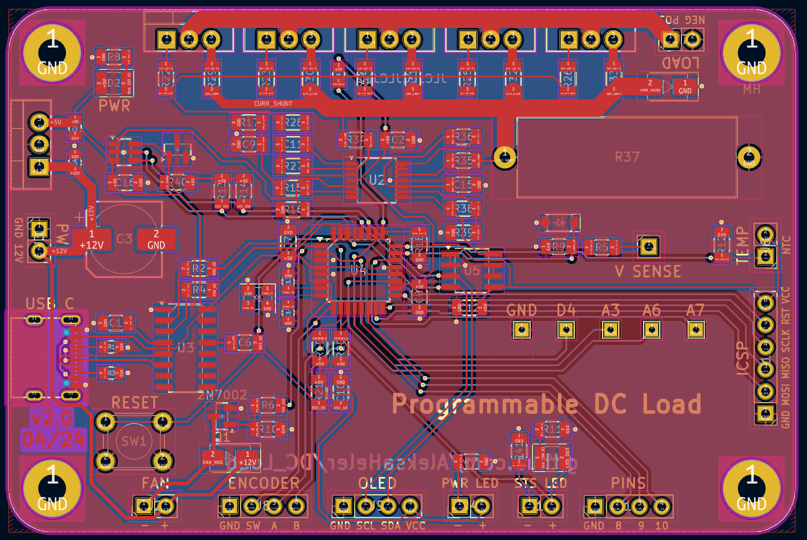
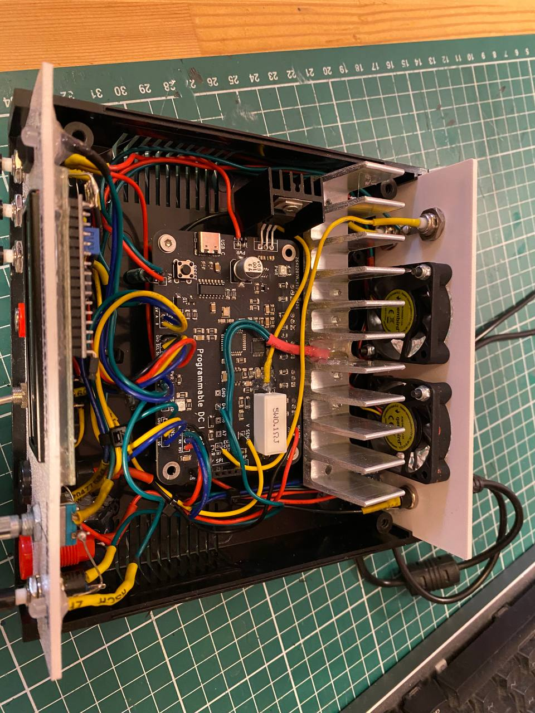
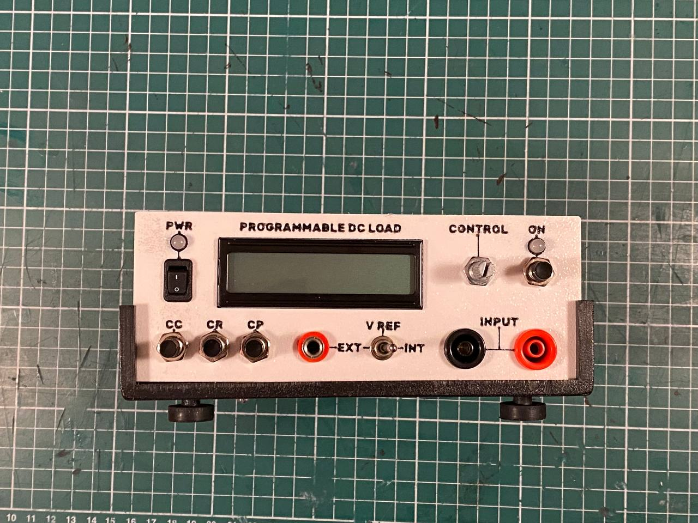

# Programmable DC Load

Flexible programmable DC constant current/power load using Arduin Nano and a custom PCB.

Following some ideas from [this YouTube playlist](https://www.youtube.com/playlist?list=PLUMG8JNssPPzbr4LydbTcBrhoPlemu5Dt) from [Scullcom Hobby Electronics](https://www.youtube.com/@scullcomhobbyelectronics1702).

## PCB design and schematic





## Finished device in enclosure




## Programming the ATmega328P

### Setting the fuses

If you just want the same ones as used in a standard Arduino, you can find them in the ```boards.txt``` file:
```
uno.bootloader.low_fuses=0xff
uno.bootloader.high_fuses=0xde
uno.bootloader.extended_fuses=0x05
```

We will be using another Arduino as ISP, so we should first program it with given example code, then we can use avrdude option 'avrisp', and use the port number of that device. We can read the fuses, and check if conncections are ok with:
``` 
.\utils\avrdude-v8.0\avrdude.exe -c avrisp -p m328p -P com23 -b 19200 -U lfuse:r:-:i -U hfuse:r:-:i -U efuse:r:-:i -v
``` 

So for these default settings we would use the following command:
``` 
.\utils\avrdude-v8.0\avrdude.exe -c avrisp -p m328p -P com23 -b 19200 -U lfuse:w:0xFF:m -U hfuse:w:0xDE:m -U efuse:w:0x05:m -v
```
Where:
```
  -c <programmer>                          Specify programmer type.
  -p <partno>                              Required. Specify AVR device.
  -P <port>                                Specify connection port.
  -b <baudrate>                            Override RS-232 baud rate.
  -U <memtype>:r|w|v:<filename>[:format]   Memory operation specification.
  -v                                       Verbose output. -v -v for more.
```
More options info can be found [here](https://www.nongnu.org/avrdude/user-manual/avrdude_3.html).


### Burning the bootloader

To burn the bootloader, we will also be using Arduino as ISP, and in Arduino software just select burn bootloader after we select the board as Arduino Uno.


### Flashing the program

???
